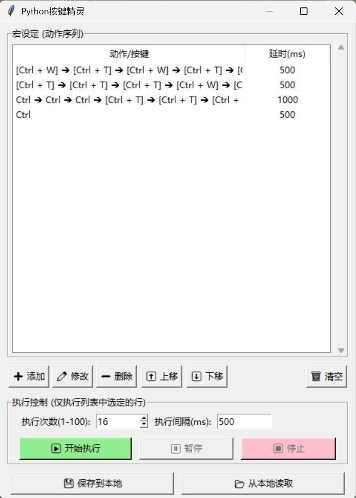
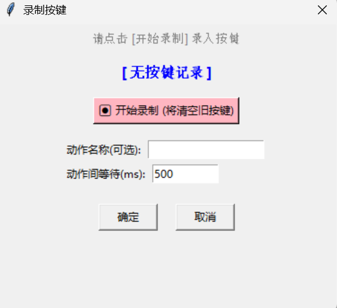

# 🐍 Python 按键精灵 (PyKeyMacro)


**PyKeyMacro** 是一个基于 Python 开发的轻量级、开源且高效的键盘宏录制与执行工具。GUI 干净直观，还原按键物理行为。

解放自动化日常办公重复劳作（作者用来自动批阅作业）。

## ✨ 核心特性

- 🎯 **真实物理状态录制**：基于底层按键的 `KeyDown` 与 `KeyUp` 状态进行判定，识别 `[Ctrl + C]` 等复杂组合键，允许单独录制 `Ctrl` 键，彻底告别按键连发或判定错乱。
- 👁️ **语义化直观显示**：采用 `[组合键] ➔ 独立键` 的箭头流线型展示（例如 `[Ctrl + C] ➔ [Ctrl + V] ➔ Enter`），动作序列一目了然。
- 🚀 **毫秒级高并发引擎**：底层基于 `threading.Event` 实现异步执行。无论你设定的延时有多长，点击“暂停/停止”都能**瞬间响应**，彻底告别界面假死。
- 🔧 **强大的序列管理**：
  - 支持双击修改已录制动作、自定义动作名称。
  - 支持动作的上移、下移及任意排序。
  - **精准触达**：支持在列表中单选或**多选**动作，仅执行选中的行。
- 💾 **无缝本地化存储**：全局循环参数与宏数据自动打包保存为 JSON 文件，启动时默认加载当前目录下的 `default.json`，且完美向下兼容旧版本数据结构。
- 🛡️ **人性化保护机制**：执行前内置 3 秒安全倒计时，方便用户从容切换至目标工作窗口。

## 📸 界面预览
<!-- `*(建议在此处放一张软件运行截图，例如 ) ` -->
<center>
  
</center>

## 🛠️ 安装与运行

### 1. 环境准备

请确保你的电脑上安装了 Python 3.7 或更高版本。

克隆本项目到本地：

```bash
git clone https://github.com/tqzvictor/PyKeyMacro.git
cd PyKeyMacro
```

### 2. 安装依赖

本项目仅依赖于 `pynput` 库来进行全局底层按键监听与模拟。

```bash
pip install pynput
```

### 3. 直接运行

```bash
python macro_sprite.py
```

## 📦 打包为独立 EXE (Windows)

如果你想将其发送给没有 Python 环境的朋友使用，可以使用 `PyInstaller` 将其打包为单个独立的 `.exe` 可执行文件。

1. 安装 PyInstaller：

   ```bash
   pip install pyinstaller
   ```

2. 执行打包命令：

   ```bash
   pyinstaller --noconsole --onefile macro_sprite.py
   ```

3. 打包完成后，在 `dist` 文件夹下即可找到生成的 `macro_sprite.exe`。双击即可开箱即用！

## 📖 使用指南

1. **录制动作**：
   - 点击 **➕ 添加** 按钮，弹出录制窗口。
   - 点击 **⏺ 开始录制**。此时按下任意按键或组合键，程序会实时记录你的物理按压状态。
   - 录制完成后，点击 **⏹ 停止录制**，可设定该动作执行后的等待时间（毫秒）以及动作名称。
   <center>
   
   </center>
2. **编辑与排序**：
   - 双击列表中的任意一条记录即可重新录制或修改延时。
   - 使用 **⬆️ 上移** 和 **⬇️ 下移** 自由调整执行顺序。
3. **执行宏**：
   - 设定全局“执行次数”与“每次循环间隔”。
   - **选中你想执行的动作条目（按住 Ctrl/Shift 可多选）**。
   - 点击 **▶ 开始执行**，程序会倒计时 3 秒后开始工作。执行期间可随时点击 **⏸ 暂停** 或 **⏹ 停止**。

## 📂 JSON 数据结构说明

```json
{
    "loop_count": 1,
    "interval_ms": 500,
    "macros": [
        {
            "keys": [
                [
                    "Key.ctrl_r",
                    "c"
                ]
            ],
            "delay": 500,
            "name": "复制"
        },
        {
            "keys": [
                [
                    "Key.ctrl_r",
                    "v"
                ]
            ],
            "delay": 500,
            "name": "粘贴"
        }
    ]
}
```

## ❤️ 鸣谢

本工具在 **Google AI Studio (Gemini Pro 3.1 Preview)** 的协作下完成。

## 🤝 参与贡献

欢迎提交 Issue 和 Pull Request，欢迎 Fork 本项目。

## 📄 许可证

本项目基于 [MIT License](LICENSE) 协议开源。

---
**⭐ 如果这个项目帮助到了你，请给它点一个 Star！**
